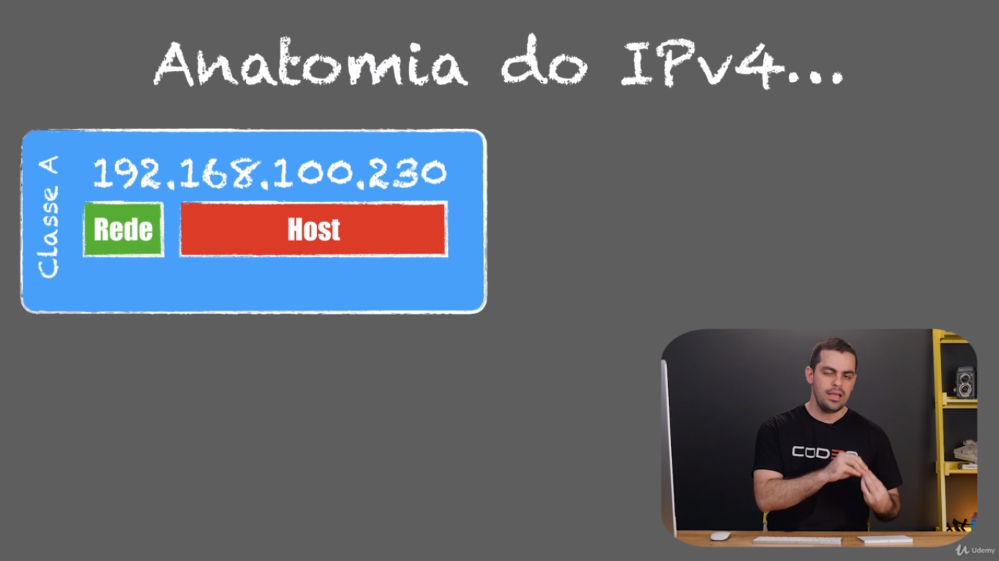
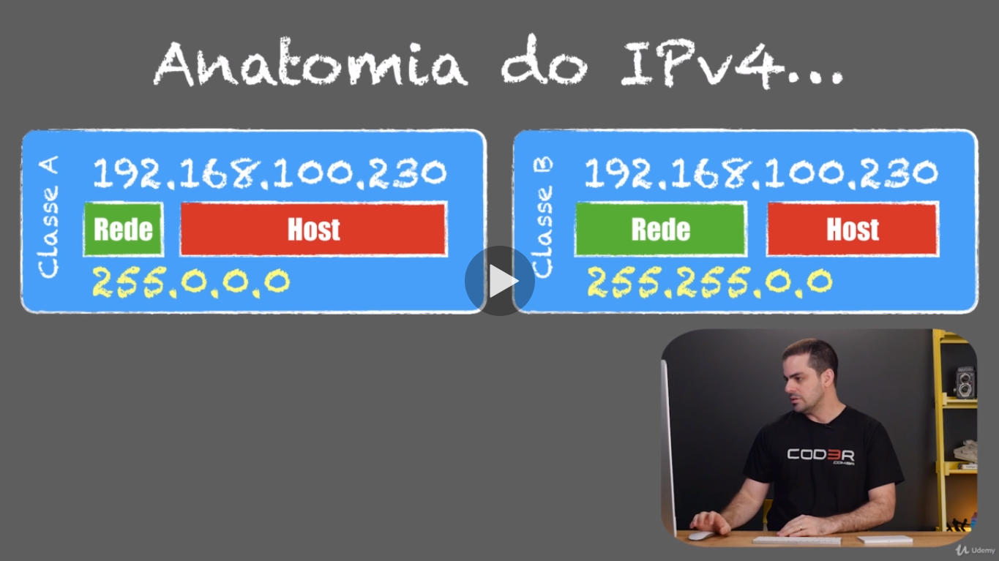
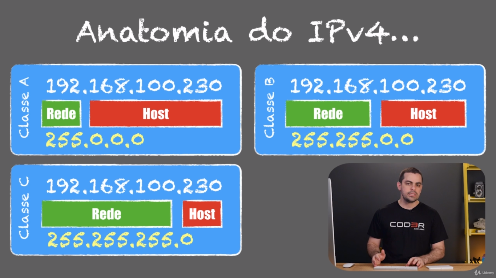
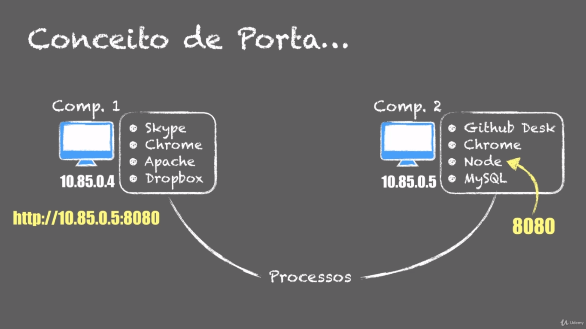
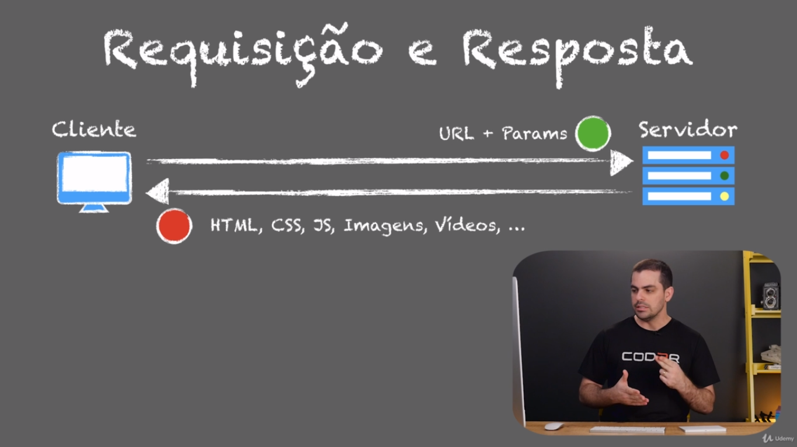
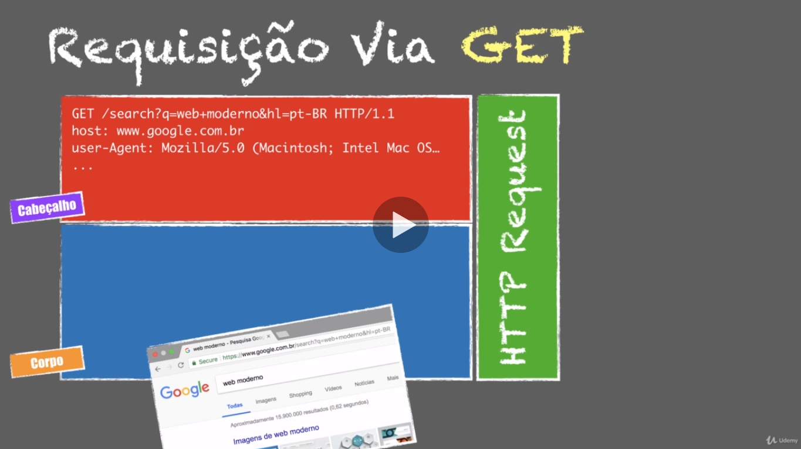
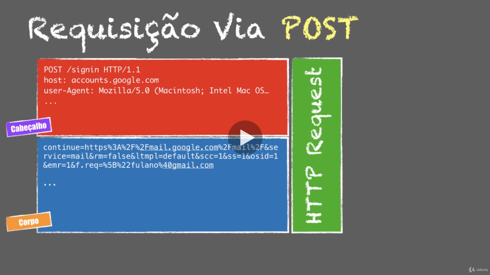
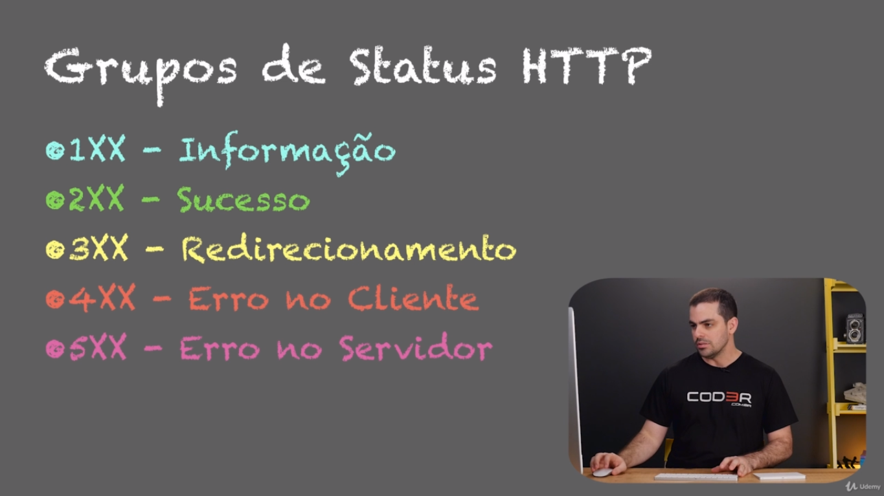

# Conceito de WEB para o Front End

## TCP/IP

Transmission Control Protocol / Internet Protocol
- TCP: Orientado a conexão e confiável

-IP: Roteamento entre redes || Endereçamento de redes

## CAMADAS TCP/IP

### APLICAÇÃO
- HTTP, FTP, SMTP
- Comunicação Processo-a-Processo
- Número da porta

### TRANSPORTE
- TCP (Pode ser UDP)
- Confiabilidade, Integridade
- Comunicação HOST-a-HOST

### INTERNET
- IP
- Conexão entre redes
- Transferência de pacotes

### REDE/FÍSICA
- Ethernet/Wi-fi
- MAC Adress
- Física, Enlace

## UDP -> User Datagrama Protocol: 
Mais leve, recomendado para Streamers, Jogos Online, e outros serviços que requerem mais velocidade. Sua diferença ao TCP é que o TCP envia uma resposta a uma requisição de recebimento de dados e o UDP, apenas recebe, sem confirmar se recebeu o pacote de dados. Isto tendo sua vatagens e desvantagens

## Anatomia IPv4

## Conceito de porta

# Protocolo HTTP (Hyper Text Transfer Protocol)
- Faz parte da camada de Aplicação
- Stateless
- Cliente <-> Servidor
- TCP/IP
- HTML, CSS, JavaScript e mídia

### Métodos do HTTP
- Get
- Post
- Put
- Delete
- Trace
- Options
- Connect
- Head

### Requisição e Resposta

## Requisição do tipo GET

## Requisição do tipo POST

## Grupo de status HTTP
