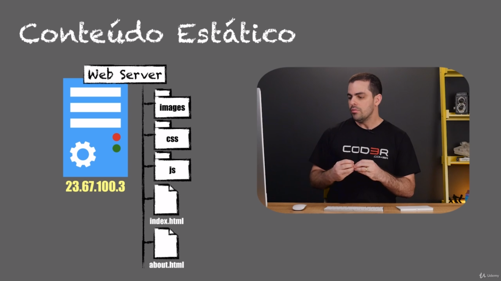
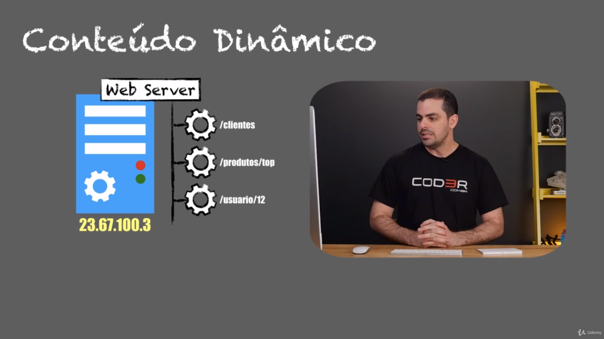
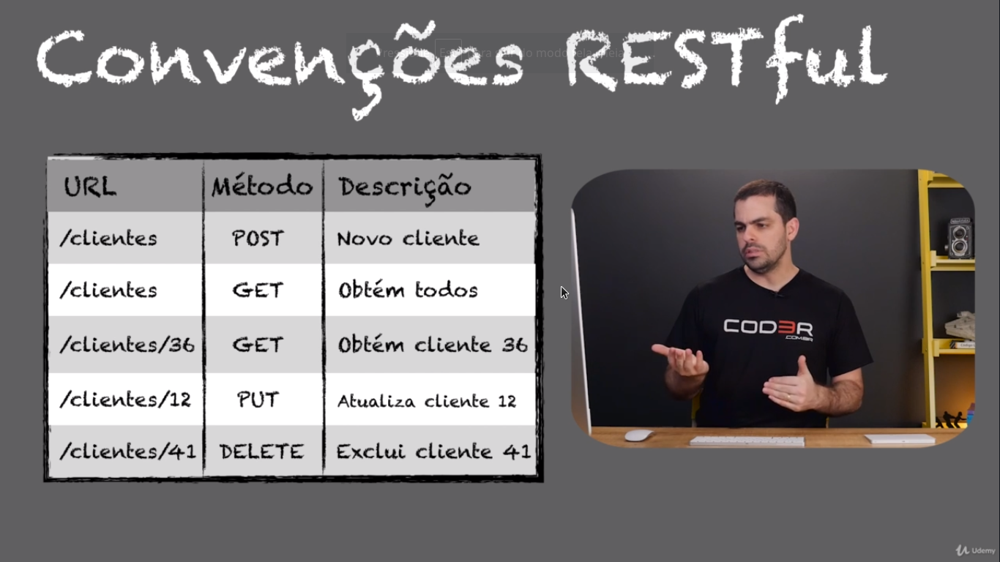

# Conceito de WEB para o Front End

## TCP/IP

Transmission Control Protocol / Internet Protocol
- TCP: Orientado a conexão e confiável

-IP: Roteamento entre redes || Endereçamento de redes

## CAMADAS TCP/IP

### APLICAÇÃO
- HTTP, FTP, SMTP
- Comunicação Processo-a-Processo
- Número da porta

### TRANSPORTE
- TCP (Pode ser UDP)
- Confiabilidade, Integridade
- Comunicação HOST-a-HOST

### INTERNET
- IP
- Conexão entre redes
- Transferência de pacotes

### REDE/FÍSICA
- Ethernet/Wi-fi
- MAC Adress
- Física, Enlace

## UDP -> User Datagrama Protocol: 
Mais leve, recomendado para Streamers, Jogos Online, e outros serviços que requerem mais velocidade. Sua diferença ao TCP é que o TCP envia uma resposta a uma requisição de recebimento de dados e o UDP, apenas recebe, sem confirmar se recebeu o pacote de dados. Isto tendo sua vatagens e desvantagens

## Anatomia IPv4

## Conceito de porta

# Protocolo HTTP (Hyper Text Transfer Protocol)
- Faz parte da camada de Aplicação
- Stateless
- Cliente <-> Servidor
- TCP/IP
- HTML, CSS, JavaScript e mídia

### Métodos do HTTP
- Get
- Post
- Put
- Delete
- Trace
- Options
- Connect
- Head

### Requisição e Resposta

## Requisição do tipo GET

## Requisição do tipo POST

## Grupo de status HTTP

# Servidores WEB

## WEB STACK

### Lamp - Linux, Apache, MySQL, PHP

Linux -> Sistema Operacional

Apache -> Web Server

MySQL -> Banco de dados

PHP -> Linguagem

## Server Side vs Cliente Side

Server-side diz respeito ao lado do servidor (seu servidor de aplicação, ex: IIS). Client-side diz respeito ao lado do cliente (ex: um web-browser)

## Conceúdo estático x conteúdo dinâmico

### O que é um site?
Primeiramente, vale a pena entender o que é um site, ainda que todos conheçam o conceito na prática. Um site é uma coleção de páginas organizadas e localizadas em um servidor. Ele pode ser estático ou dinâmico. Veja só as diferenças!

### Site estático

Um site estático é aquele que não conta com ferramentas de gerenciamento para alterações, mudanças ou reformulações realmente significativas de conteúdo, sem alteração do código fonte.

Isso significa que, caso você deseje realizar esse tipo de modificação em um website estático, precisará de um profissional que tenha conhecimento de linguagens como CSS, JavaScript, PHP ou mesmo HTML.

### Site dinâmico

Um site dinâmico é o contrário do estático. Ele permite que sejam realizadas constantes alterações de conteúdo, como a criação de páginas, mas sem a necessidade de alteração no código fonte por parte de um profissional da área.

Também chamado de site gerenciável, o site dinâmico conta com um sistema de gerenciamento integrado, possibilitando a realização de alterações por meio de um CMS (Content Management System), como o WordPress.

Muitas pessoas fazem o site dinâmico PHP, ou seja, por meio de uma das linguagens mais usadas na atualidade. A vantagem de utilizar PHP é que ele possui código aberto, uma grande comunidade de desenvolvedores para trocar informações e uma vasta documentação na internet.

# HTML, CSS e JavaScript

### HTML

> HTML responsável pela marcação, estruturação do arquivo

### CSS

> CSS estilização da aplicação

# DNS

## O que é?

> DNS: Domain Name System, ou sistemas de nome de domínio

- Transforma um nome de domínio em um endereço IP

`www.cod3r.com.br` -> 54.69.61.89

# HTTP Seguro (HTTPS)

1.png)

Certificado != Protocolo

Certificado SSL/TLS -> Incorreto

Certificado com os **protocolos** SSL/TLS -> correto

### HTTPS: 
> Os dados são criptografados usando os procolos TLS/SSL

>Protege contra intercepção (MITM)

> Criptografas todas informações: URL, Cookies, e Headers

> Usa certificados digitais

# WEB SERVICE

> (Soup)
Simple Object Access Protocol

> (Rest)
Representational State Transfer

SOUP | REST
----|----
WSDL|JSON
XML|HTTP
RPC|
Burocrático|Simples

### Convenção RESTful

