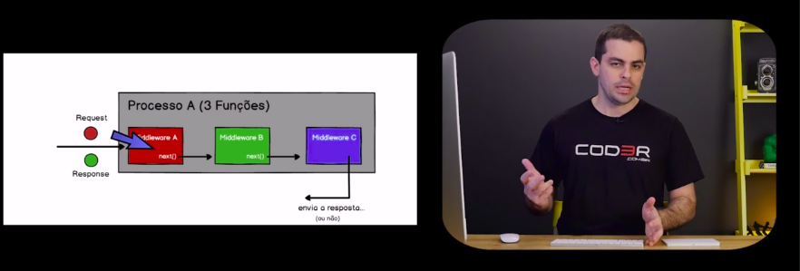

# Padrão Middleware

## Processo padrão:

**Processo A**
```
$ PassoA {
$   executa...
$   chamaPassoB(passoB)
$ }
```

```
$ PassoB {
$   executa...
$   chamaPassoC(passoC)
$}
```

```
$ PassoC {
$   executa...
$}
```

O problema aqui, é que sempre há uma amarração para o próximo processo, sendo assim, impossível reaproveitar o escopo do código sem modifica-lo

## Chain of Responsibility:

Em OO, é um padrão GOF cuja a principal função é evitar a dependência de um objeto receptor e um objeto solicitante



### Exemplo:

```
$ PassoA {
$   executa...
$   next( *Aponto onde quero* )
$ }
```

```
$ PassoB {
$   executa...
$   next( *Aponto onde quero* )
$}
```

```
$ PassoC {
$   executa...
$  *Envia resposta (ou não)* 
$}
```


